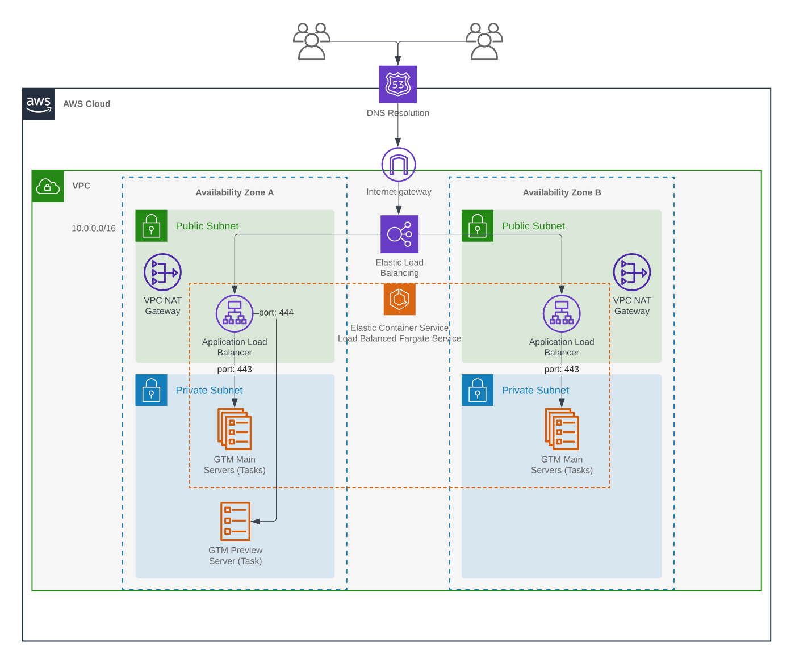

# Server-Side Google Tag Manager on AWS ECS Fargate

This is an example CloudFormation stack with [AWS CDK (Python)](https://docs.aws.amazon.com/cdk/api/v2/python/index.html)
that can be used to set up the infrastructure for a Server-Side Google Tag Manager installation on AWS.

You can use the project to output CloudFormation template (`cdk synth`) or manage the whole deployment (`cdk deploy`).

I also wrote a blog post with more details about the project: [Deploy Server-Side GTM on AWS ECS Fargate with CDK/CloudFormation](https://larihaataja.com/deploy-server-side-gtm-on-aws-ecs-fargate/).

## Architecture

The stack creates a [Load balanced Fargate service on Elastic Container Service (ECS)](https://docs.aws.amazon.com/AmazonECS/latest/userguide/service-load-balancing.html). Fargate is a serverless capacity type on AWS, meaning you no longer have to provision,
configure, or scale clusters of virtual machines to run containers. This removes the need to choose server types, 
decide when to scale your clusters, or optimize cluster packing. You can simply select the amount of CPU and memory that you want
for each instance and AWS will manage the hardware.

The stack creates a [VPC (virtual private cloud)](https://docs.aws.amazon.com/vpc/latest/userguide/what-is-amazon-vpc.html) using 2 availability zones. Both zones have a public subnet and a private subnet. The load balancer will operate on the public subnets, being accessible to the public via the internet, while the Server-side GTM containers will run in the private subnets, accessible only to VPC services (e.g. the load balancer).

To reduce cost (~20€/month), the preview server shares the load balancer with the main servers but uses a different port.



## Installation

To use this template you need:

- An AWS account and [AWS CLI](https://aws.amazon.com/cli/) installed
- Python 3
- [Google Tag Manager Server Container](https://developers.google.com/tag-platform/tag-manager/server-side)
- Registered domain name (optional but highly recommended)

### 1. Create a virtualenv (MacOS and Linux)

```
$ python3 -m venv .venv
```

### 2. Activate your virtualenv

On MacOS or Linux:

```
$ source .venv/bin/activate
```

If you are a Windows platform, you would activate the virtualenv like this:

```
% .venv\Scripts\activate.bat
```

### 3. Install the required dependencies

```
$ pip install -r requirements.txt
```

## Configuration

There are a number of context variables in `cdk.json` that can be used to tune the setup.
You can either define the variables in the file or add them as CLI parameters when
executing `cdk` commands.

| Variable | Description | Default value |
|-|-|-|
| `cpu` | The amount of CPU per Fargate task (server instance). 256 = 0,25vCPU, 512 = 0,5vCPU etc. | 256 |
| `mem` | The amount of memory per Fargate task (server instance). Minimum is 512 MiB | 512 |
| `desiredNodeCount` | How many tasks (server instances) you wish to be running by default | 1 |
| `taskMaxCapacity` | What is the maximum number of tasks (server instances) to run at a time | 2 |
| `taskMinCapacity` | What is the least amount of tasks (server instances) to run at a time | 1 |
| `targetCpuUtilization` | The average CPU utilization percentage that will trigger the cluster to add more tasks (server instances) | 70 |
| `containerConfig` | The Container Configuration string for the GTM server container. Passed as `CONTAINER_CONFIG` environment variable to the GTM container image | `null` |
| `certificateArn` | The ARN of an SSL certificate in AWS Certificate Manager for `domain` (used for HTTPS) | `null` (optional) |
| `domain` | The domain name for the service. | `null` (optional) |
| `hostedZoneId` | AWS Route53 Hosted Zone ID (if using AWS name servers with the domain) | `null` (optional) |
| `hostedZoneName` | The Hosted Zone name (i.e. domain) | `null` (optional) |

To use them in CLI:

```
cdk deploy -c cpu=512 -c containerConfig=XYZ123
```

### Domain and HTTPS Certificate Setup

#### Option A: Using AWS Route53 name servers

The easies way to use a custom domain is to have your name servers hosted in AWS Route53. This is a very good choise especially if you use
AWS to also host the website(s) where you want to use the server-side GTM. In practice, you need a Hosted Zone either for the exact domain 
you want to use, e.g. `gtm.mydomain.com` or for the domain above it, e.g. `mydomain.com`.

If you provide the `hostedZoneId` and `hostedZoneName` context variables, the stack will create an SSL certificate (for HTTPS) automatically.
Alternatively, you can create/upload the certificate manually in AWS Certificate Manager and add it to the `certificateArn` context variable.

For example, if you have a hosted zone for `mydomain.com` and you want the server-side GTM to use `gtm.mydomain.com` you could use the following
context variables:

```
cdk deploy -c domain=gtm.mydomain.com -c hostedZoneName=mydomain.com -c hostedZoneId=<Hosted Zone ID from AWS>
```

#### Option B: Using external name servers

It's also possible to use external name servers and redirect your custom domain the server-side GTM with a `CNAME` DNS record.

In this case you should follow these steps:

1. Create an SSL certificate in AWS Certificate Manager or upload your existing certificate there.
    - You can do DNS validation by adding the CNAME record(s) to the domain with your existing name server provider
    - Once the certificate is issued, copy the ARN from AWS management console
2. Deploy the stack by adding `domain` and `certificateArn` context variables, e.g.
```
cdk deploy -c domain=gtm.mydomain.com -c certificateArn=<ARN for the certificate copied from AWS management console>
```
3. Create a `CNAME` record for your domain and add the load balancer URL as the value.
    - The `cdk deploy` command will write the load balancer URL in the terminal after deployment has finished

## Usage

After installation and setting up the context variables in `cdk.json`, you can use following `cdk` commands:

 * `cdk ls`          list all stacks in the app
 * `cdk synth`       emits the synthesized CloudFormation template
 * `cdk deploy`      deploy this stack to your default AWS account/region
 * `cdk diff`        compare deployed stack with current state
 * `cdk docs`        open CDK documentation

If you use multiple profiles with you AWS CLI, you can add the `--profile` flag with the `cdk` command.

For example, I want to deploy the stack with min 3 and max 6 server instances using 0,5 vCPU and 1024 MiB per server
and a domain hosted in AWS Route53. I have a separate profile called `sgtm` for the AWS account, and I want to
deploy the stack in AWS region `eu-west-1`, I could use the following command:

```
CDK_DEFAULT_ACCOUNT='0123456789' CDK_DEFAULT_REGION='eu-west-1' cdk deploy \
    -c cpu=512 \
    -c mem=1024 \
    -c desiredNodeCount=3 \
    -c tasMinCapacity=3 \
    -c taskMaxCapacity=6 \
    -c domain=gtm.mydomain.com \
    -c hostedZoneId=ASDFGHJK123 \
    -c hostedZoneName=mydomain.com \
    --profile sgtm
```

Notice how you might also need to define the `CDK_DEFAULT_ACCOUNT` and `CDK_DEFAULT_REGION` environment variables.

## Links

- [Server-Side Google Tag Manager Documentation](https://developers.google.com/tag-platform/tag-manager/server-side)
- [AWS CDK Python API Reference](https://docs.aws.amazon.com/cdk/api/v2/python/modules.html)
- [AWS ECS on AWS Fargate Documentaion](https://docs.aws.amazon.com/AmazonECS/latest/developerguide/AWS_Fargate.html)
- [AWS Route53 Documentation](https://docs.aws.amazon.com/route53/index.html)
- [AWS Certificate Manager Documentation](https://docs.aws.amazon.com/acm/)